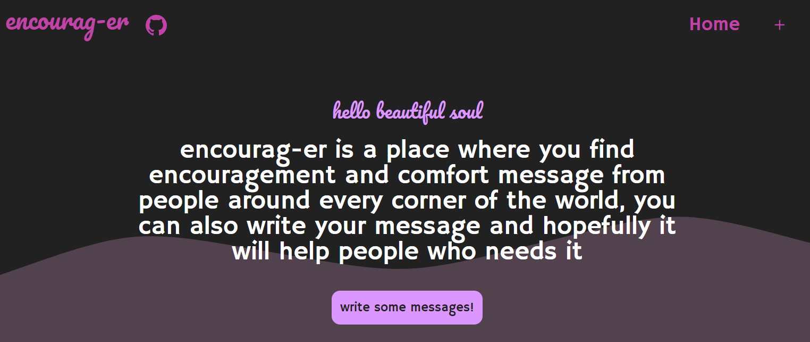
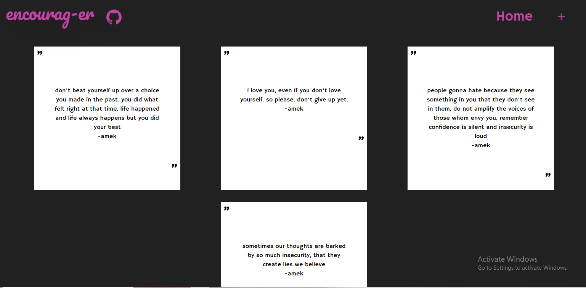
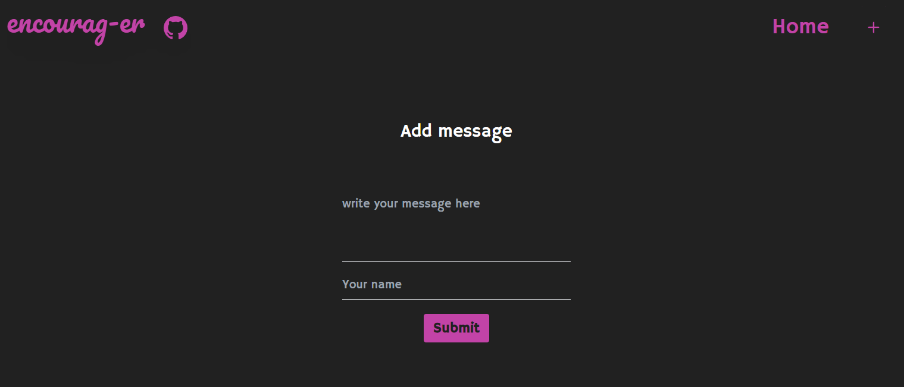

##  Encourag-er 
website to write encouraging messages

## overview
Main page

Messages 

Add messages page



## libraries/framework used

MongoDB 
Express
NodeJS
React
nodemon
wavify

## how to use my project

```
open encourag-er directory 
npm i axios
npm install react-wavify
run npm start
open backend directory
npm i express cors mongoose morgan
npm i morgan
run nodemon server.js
```
